# Project 1: Object Detection in an Urban Environment

## General notes and issues

During the course of the project, I was forced to come up with several tricks to compile my code. I attempted to work in the environment provided by you (as described in the instructions). Unfortunately, this did not work. The Mozilla browser kept crashing.

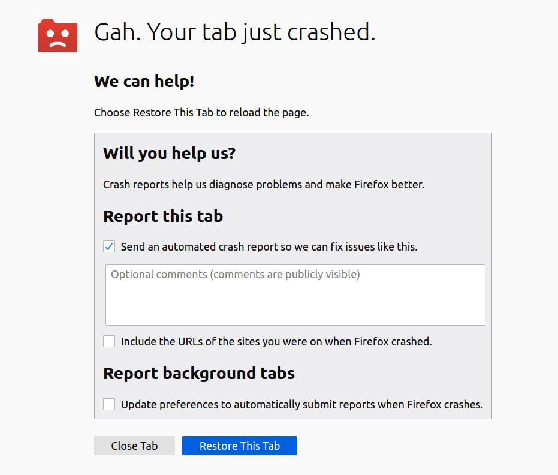

Even after I installed the Chromium browser, it also kept crashing.

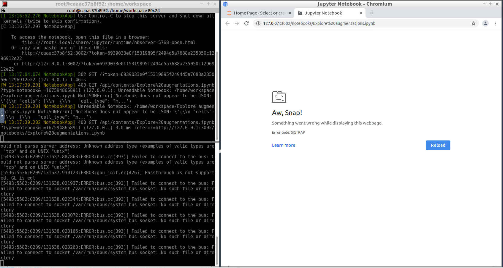

I was only able to run my code, which I implemented on my personal laptop, once out of 10 attempts. Even the Jupyter Notebook `Explore augmentations.ipynb` could not be opened.

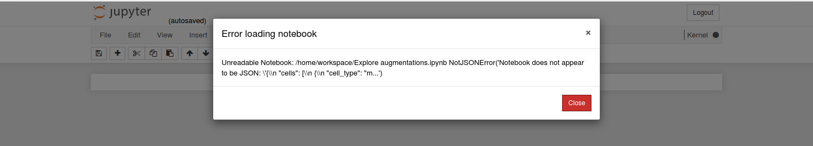

It was only possible to open the notebook directly in Github. As a result, I created another notebook `My Explore augmentations.ipynb`.

I tried to download my workspace to work on a laptop with a graphic card. However, I was not able to set up the environment and to make matters worse, the download failed. I had to download everything separatly and then add the files to my GitHub. If something is missing everything is available in my workspace and all implemented parts work there with no issues if you start it from terminal and avoid using jupyter notebook in my workspace.

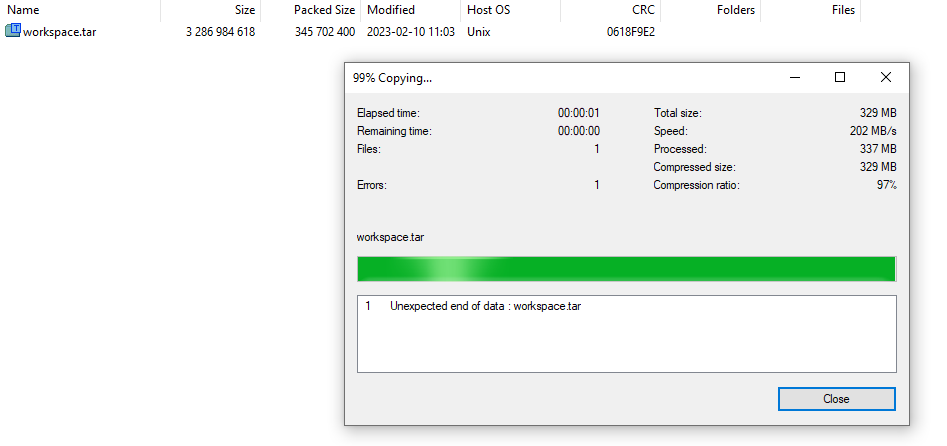

I was truly confused throughout the entire project. I apologize if the project is not well documented enough. It was due to my frustration and headaches during the project.

Finally, I tried to upload everything to my workspace, including this README file.

## Goal

Classification and detection of cars, pedestrians and cyclists in images.

### Available data

The data we will use is organized as follow:
```
/home/workspace/data/
    - train: contain the train data 
    - val: contain the val data 
    - test: contains the test data
```

## Step 1a - Exploratory Data Analysis (EDA)


### Implementing the function `display_images.py`

It was mentioned using the folder /data/waymo/training_and_validation/ which I could not find in the workspace. So I just used the folder /data/train/ for the exploration.

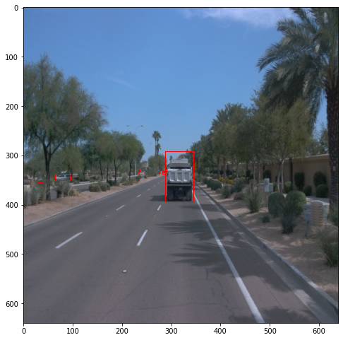
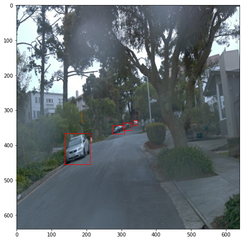
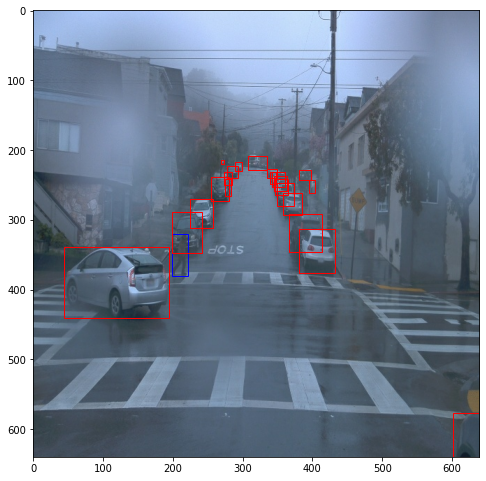
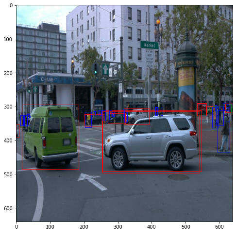

### Analysis

I analyzed a random sample of 30,000 from the dataset.

1. Class distribution analysis

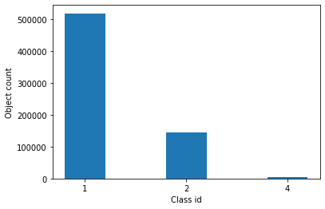

The distribution of classes among the classes is highly uneven. The largest number of classes belong to class 1 (cars), while class 4 (cyclists) and class 2 (pedestrians) have the least number of samples, with Class 4 being the rarest.

2. Distribution of objects in images (using splited image into 10*10 grid)

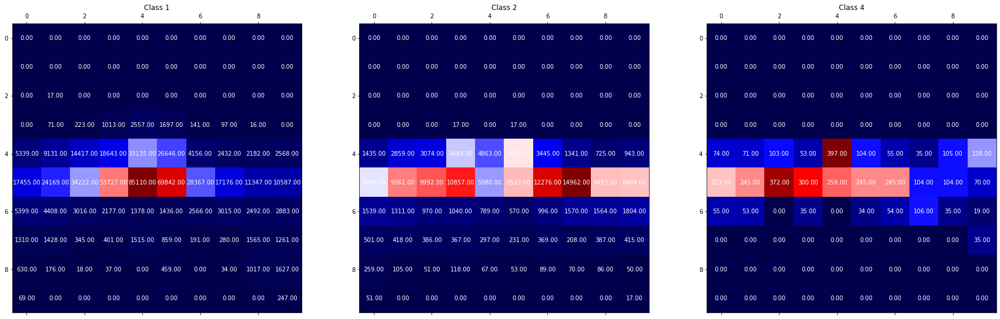 

The analysis indicates that the majority of objects are located in the center of the image, with fewer on the sides and almost no/few objects at the top or bottom. The dataset has a slight horizontal imbalance, therefore applying random horizontal flipping could be beneficial.

3. Distribution of object bounding box in image (using splited image into 10*10 grid)

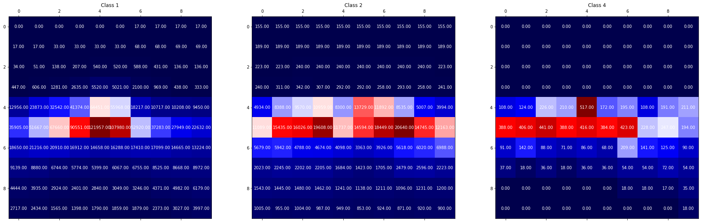 

Both the current and previous distributions demonstrate that while the object centers tend to be located in the center of the image, their bounding boxes sometimes extend to the corners. The high values in the center of the distribution suggest that the majority of the bounding boxes cover the center of the image.

4. Distribution of class frequency in an image

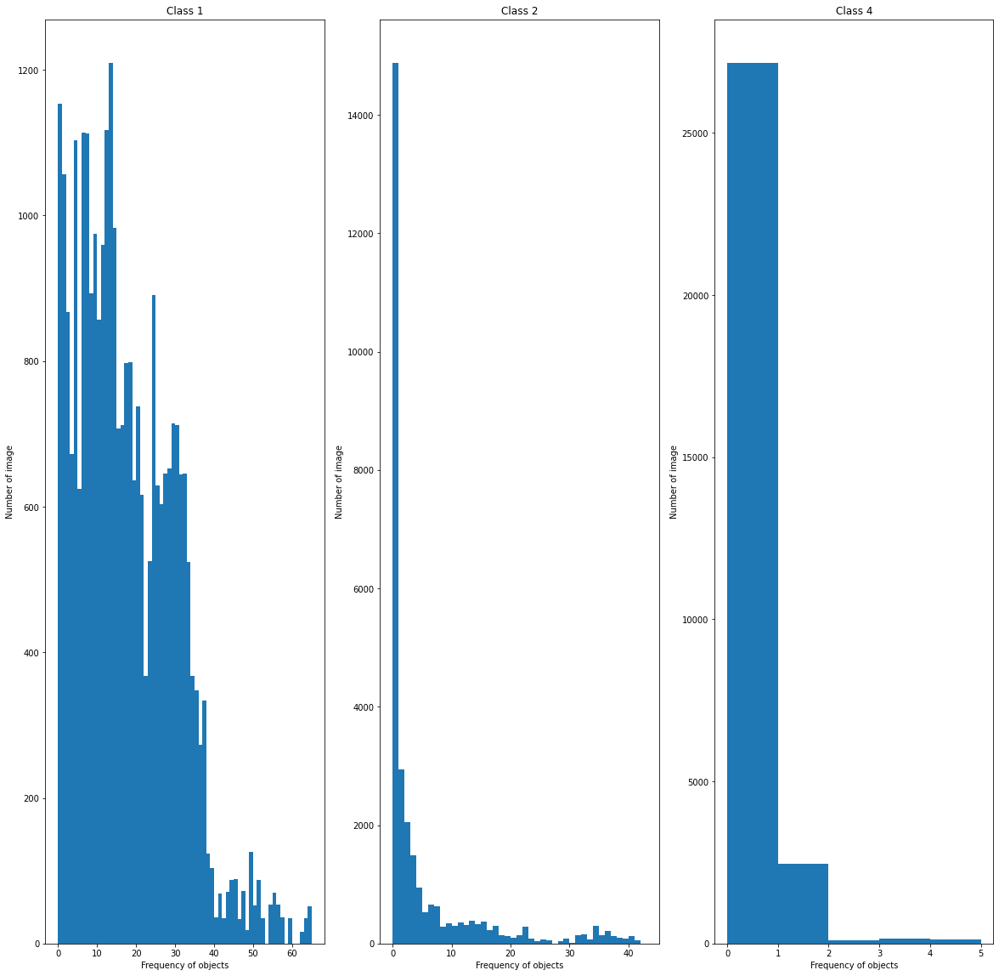 

Additionally, browsing through the data shows that there are fewer examples taken in dark or foggy conditions when compared to those taken in clear daylight conditions. To counterbalance this, introducing random brightness, contrast, and color variations should be helpful.

## Step 1b - Create the training - validation splits

I don't understand this step because the data in my workspace was already split. That's why I didn't run the script `create_splits.py`.

## Step 2 - Edit the config file

Executed as discribed in the project instructions and a new config file `pipeline_new.config` has been created and moved to the folder `/home/workspace/experiments/reference/`.

## Step 3 - Model Training and Evaluation

The training process was launched as discribed in the project instructions and tensorboard had the following output:

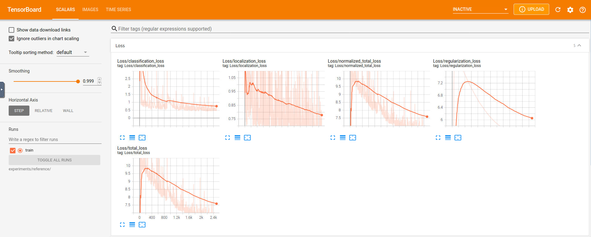 
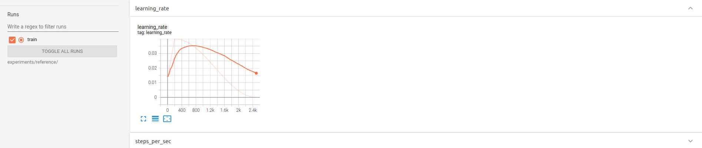

## Step 4 - Improuve the performance

In order to improve the classification goodness I explored the Object Detection API and applied many different augmentations using different strategies.

These strategies were added directly to the config file `pipeline_new.config` in the folder `/home/workspace/experiments/reference/`. 

For instance, I added the augmentation for adjusting the saturation of the image with the following command lines:

```
data_augmentation_options {
  	random_adjust_saturation{
    }
  }
```
I also changed the base learning rate from 0.04 to 5^10-4.

|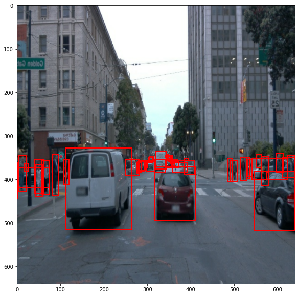 | 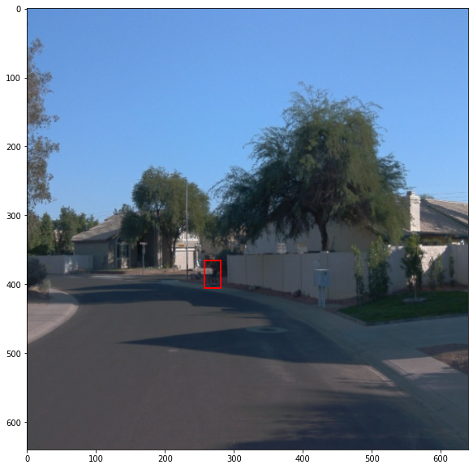|

After I modified the configuration file, I restarted the training and the following TensorBoard output was produced.

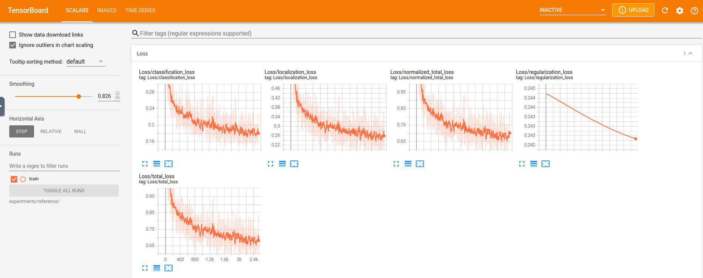 
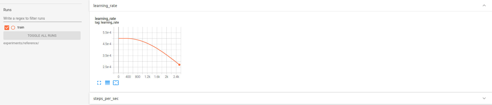

After the training process is done, I executed the evaluation command

```
python experiments/model_main_tf2.py --model_dir=experiments/reference/ --pipeline_config_path=experiments/reference/pipeline_new.config --checkpoint_dir=experiments/reference/
```

and started again TensorBoard with the following output:

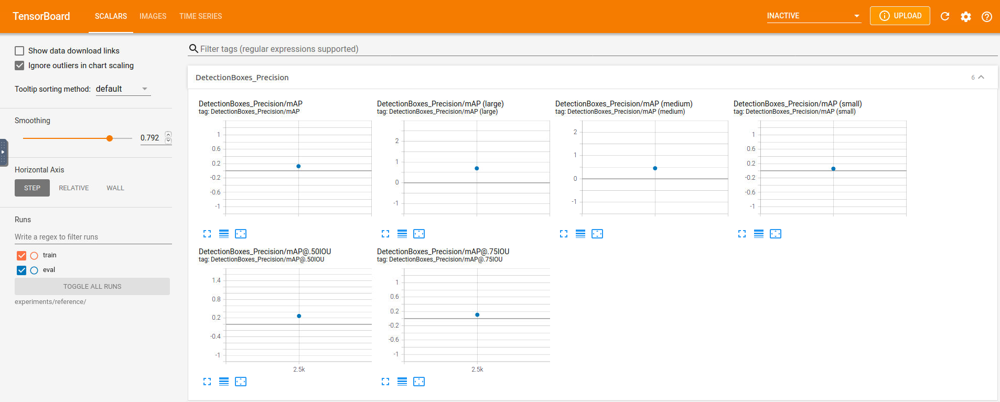 
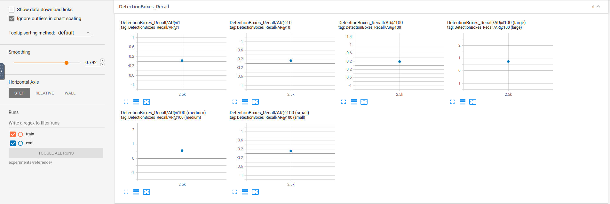
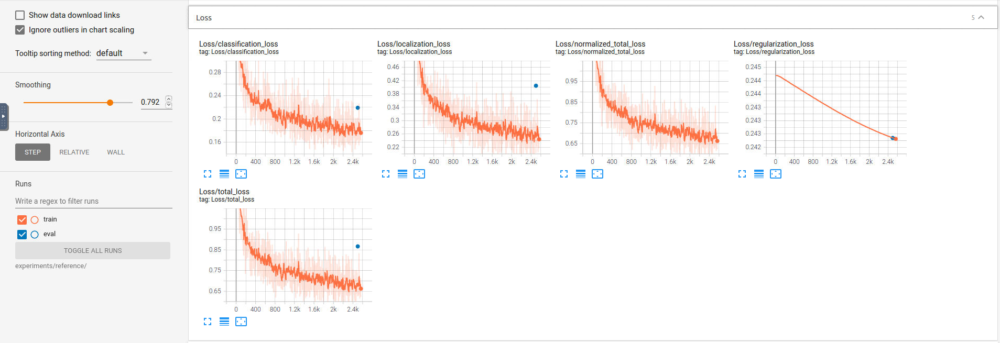 

### Creating animations

 

 

